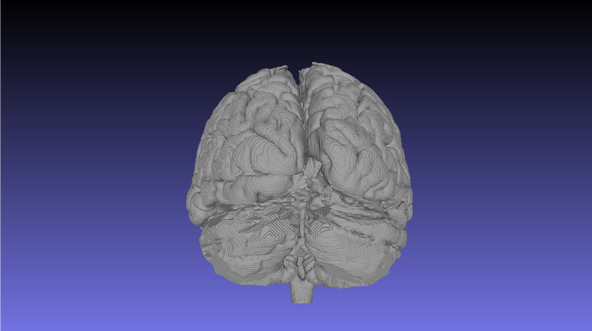

## Marching Cubes

This is a C++ implementation of the Marching Cubes algorithm [1] adapted from [2].

The Marching Cubes algorithm is a computer graphics algorithm to extract a polygonal mesh (in this implementation, a triangular mesh) of an isosurface from a three-dimensional discrete scalar field.

A three-dimensional scalar field can be specified as a txt file in the format specified below and the triangular mesh is obtained in the Stanford PLY file format [3] which can be visualized using any mesh visualizer such as Paraview, Blender, etc.

### Usage

The driver file is `main_march.cpp`. To run `main_march.cpp`, run the following commands:

```shell
make main_march
./main_march <inp_file_path> <out_file_path> <float_isovalue>
```

This command will read the scalar field specified in `<inp_file_path>` and extract an isosurface with functional value `<float_isovalue>` as a PLY file to `<out_file_path>`.

##### Example Usage

```shell
make main_march
./main_march data/txt_in/healthy_brain.txt data/ply_out/healthy_brain_72.ply 72.0
```

##### Input File Format

The input scalar field can be specified as a grid in a text file. The text file contains as many lines as there are number of points in the 3D grid. Each line of the text file is of the following format:
```
x y z value
```
where `x,y,z` specify the location in the grid and `value` assigns a functional value to that location.

### Demo

The following images are obtained by running this implementation on a scalar field obtained from the MRI scan of the human brain.





### References

[1] Lorensen, William E., and Harvey E. Cline. “Marching Cubes: A High Resolution 3D Surface Construction Algorithm.” Proceedings of the 14th Annual Conference on Computer Graphics and Interactive Techniques  - SIGGRAPH '87, 1987, doi:10.1145/37401.37422. 
[2] Brooke, Paul. “Polygonising a Scalar Field.” Polygonising a Scalar Field (Marching Cubes), paulbourke.net/geometry/polygonise/. 
[3] Brooke, Paul. PLY - Polygon File Format, paulbourke.net/dataformats/ply/.